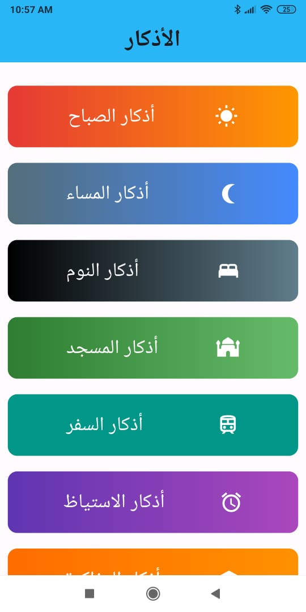
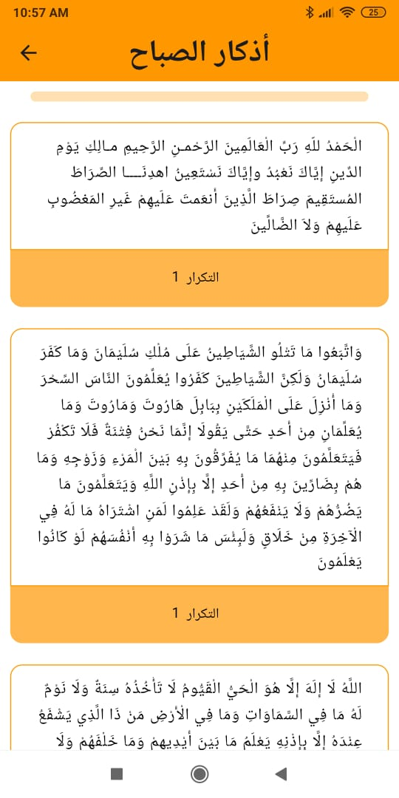
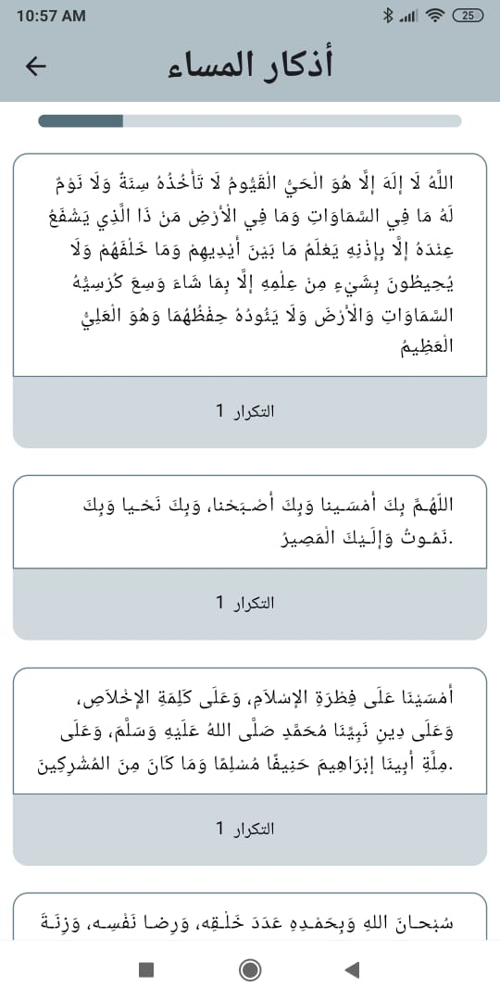
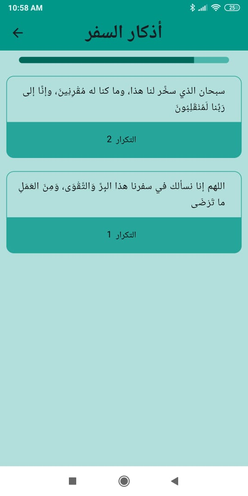

# Islamic Prayers App

Islamic Prayers App is a mobile application developed using Flutter, designed to assist users in reciting and managing various Islamic prayers and supplications conveniently.

## Features
- **Morning Prayers:** Access morning prayers (أذكار الصباح).
- **Evening Prayers:** Access evening prayers (أذكار المساء).
- **Sleeping Prayers:** Access prayers before sleeping (أذكار النوم).
- **Mosque Prayers:** Access prayers related to visiting the mosque (أذكار المسجد).
- **Travel Prayers:** Access prayers for travelers (أذكار السفر).
- **Waking Up Prayers:** Access prayers upon waking up (أذكار الاستياظ).
- **Studying Prayers:** Access prayers for studying (أذكار المذاكرة).
- **Progress bar for each prayer category.**

## Screenshots

### Home Screen


### Morning Screen


### Evening Screen


### Travel Screen


### Waking Up Screen


## Installation
To run this application on your local machine, follow these steps:

1. **Clone Repository:** Clone this repository to your local machine using:
   ```bash
   git clone https://github.com/rezk1834/islamic_prayers.git
Navigate to Project: Go to the project directory:

bash
Copy code
cd islamic_prayers
Run Application: Run the application using Flutter CLI:

bash
Copy code
flutter run
Dependencies
The project uses the following dependencies:

flutter/material.dart: Core Flutter framework.
flutter/services.dart: Flutter services for system UI handling.
Additional packages for specific pages and widgets.
Usage
Explore different prayer categories by tapping on each category tile on the main screen. Each category leads to a specific page displaying prayers and supplications related to that category.

Contributions
Contributions are welcome! If you'd like to contribute to this project, please follow these steps:

Fork the project.
Create your feature branch (git checkout -b feature/AmazingFeature).
Commit your changes (git commit -m 'Add some AmazingFeature').
Push to the branch (git push origin feature/AmazingFeature).
Open a pull request.
License
This project is licensed under the MIT License. See the LICENSE file for details.